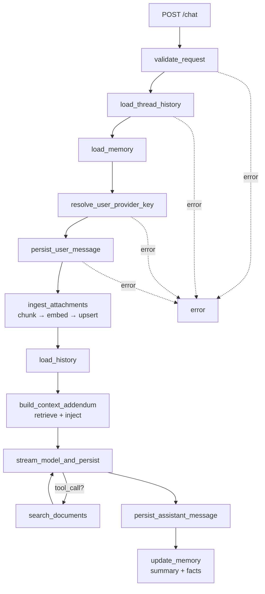
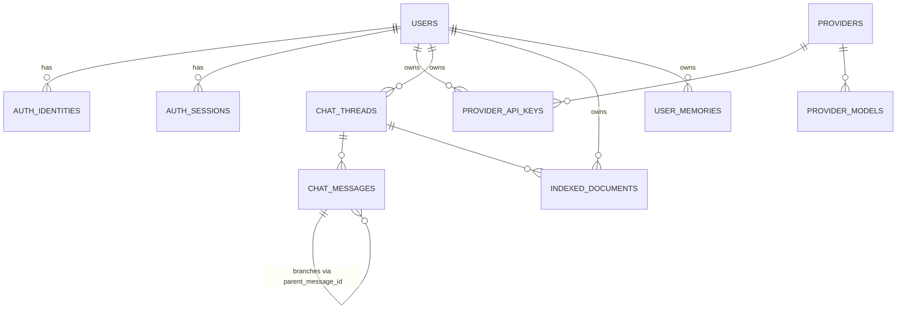

# Langchain Chatbot

Multi-provider AI chatbot with **agentic RAG**, per-thread document grounding, persistent user memory, and reasoning-token streaming. Built end-to-end with LangGraph, FastAPI, Pinecone, and Next.js.

## Highlights

- **Agentic RAG** — the model decides whether to call a `search_documents` tool; multi-turn loop with visible tool-call events in the UI.
- **Per-user, per-thread document corpus** — uploaded files are chunked, embedded, namespaced into Pinecone, and cited in responses.
- **Persistent user memory** — rolling thread summaries plus an LLM-extracted user-fact store, injected into prompts.
- **Reasoning streams** — supports both provider-native reasoning blocks and `<think>` tags, parsed across chunk boundaries.
- **Multi-provider** — OpenAI, Anthropic, Google, Groq. Per-user encrypted API keys (Fernet at rest).
- **Compare mode** — run two models on the same prompt side-by-side and pick a winner.
- **Branching** — fork a conversation from any message and explore alternatives.
- **Cross-thread search**, **per-thread system prompts**, **markdown/JSON export**, **document delete & retry**, **rate limiting**, **OAuth** (Google/GitHub/Microsoft).
- **Catalog auto-sync** — backend periodically pulls each provider's model list and upserts the catalog.

## Live Demo

Try it out: **[https://langchain-chatbot-phi.vercel.app/](https://langchain-chatbot-phi.vercel.app/)**

## Architecture

A single `POST /chat` request runs through two LangGraphs: a **prep graph** (validation, memory, persistence, ingestion, retrieval) and a **stream graph** (model + agentic tool loop). The split lets the prep graph commit DB state synchronously before bytes start streaming over the wire.



Prep graph wiring lives in [backend/app/graphs/chat_graph.py](backend/app/graphs/chat_graph.py); the streaming + tool loop is in [backend/app/graphs/_stream.py](backend/app/graphs/_stream.py).

## Data model

10 tables across four concerns: auth, provider catalog, chat, RAG/memory.



Schema in [backend/app/models.py](backend/app/models.py); migrations in [backend/alembic/versions/](backend/alembic/versions/) — they apply automatically on startup via `init_db()`.

## How RAG works here

1. **Ingest** — when a user message includes attachments, [`_ingest_attachments`](backend/app/graphs/_nodes.py) decodes, chunks, embeds (OpenAI `text-embedding-3-small`), and upserts to Pinecone under `{prefix}-{user_id}-{thread_id}`. Each file becomes one `IndexedDocument` row with status tracking and a SHA-256 dedupe checksum.
2. **Retrieve** — [`build_context_addendum`](backend/app/graphs/_nodes.py) issues a query (the user prompt, falling back to filenames if the prompt is empty) and pulls top-k chunks from the thread's namespace.
3. **Two retrieval modes**:
   - **Implicit injection** — chunks are concatenated into the system prompt before the model call.
   - **Explicit tool** — when the model supports tool calling, it's bound `search_documents` and may call it 0..N times per turn. Each call's chunks become a `ToolMessage` in history and surface in the UI as a tool-call event.
4. **Cite** — chunk metadata (filename, page, snippet) is returned in the `X-Message-Citations` response header and stored on the assistant `ChatMessage.citations` JSON column. The frontend renders inline citation chips.
5. **Manage** — users can delete or retry failed documents per thread. Pinecone vectors are removed atomically with the DB row.

## Memory

Two layers, both injected into the system prompt before each model call:

- **Rolling thread summary** — after each assistant turn, [`update_memory`](backend/app/services/memory.py) regenerates a running summary of the thread, stored on `chat_threads.summary`. Long threads stay within context without losing earlier turns.
- **User facts** — an LLM extractor pulls declarative statements ("I'm a senior Go dev", "I prefer pytest over unittest") from user messages and upserts them as keyed entries in `user_memories`. Persists across threads.

## Tech stack

| Layer | Stack |
|---|---|
| **Orchestration** | LangGraph LangChain |
| **Backend** | FastAPI, Pydantic, SQLAlchemy, Alembic, slowapi, Uvicorn |
| **AI providers** | OpenAI, Anthropic, Google Gemini, Groq |
| **Vector DB** | Pinecone (per-user namespaces) |
| **Database** | Postgres in prod (Neon), SQLite for local dev |
| **Auth** | Email/password + OAuth (Google, GitHub, Microsoft) — session tokens hashed at rest |
| **Secrets** | Per-user API keys encrypted with Fernet |
| **Frontend** | Next.js 16, React 19, Tailwind 4, shadcn/ui, Vercel AI SDK, ai-elements |
| **Tests** | pytest with in-memory SQLite + fake vector store|
| **Hosting** | Render (backend), Vercel (frontend), Neon (Postgres) |
| **Tooling** | uv (Python), pnpm (Node), GitHub Actions CI |

## Local dev

### Backend

```bash
cd backend
cp .env.example .env          # fill in required vars (see below)
uv sync
python main.py                # :8000, runs migrations on startup
uv run pytest tests/          # run all tests
```

### Frontend

```bash
cd frontend
pnpm install
pnpm dev                      # :3000
pnpm lint
```

### Required environment variables (backend)

| Variable | Notes |
|---|---|
| `API_KEY_ENCRYPTION_KEY` | Fernet key — `python -c "from cryptography.fernet import Fernet; print(Fernet.generate_key().decode())"` |
| `AUTH_SECRET` | Session token + OAuth state secret |
| `BACKEND_CORS_ORIGINS` | Comma-separated, e.g. `http://localhost:3000` |
| `PINECONE_API_KEY` + `PINECONE_INDEX_NAME` | Required for RAG |
| `OPENAI_API_KEY` | Server-side embedding key (falls back to user's stored key) |
| `DATABASE_URL` | Defaults to `sqlite:///./chatbot.db`. Set to a Postgres URL in prod. |

Full list with optional vars in [backend/README.md](backend/README.md).

## Project structure

```
backend/
  app/
    graphs/              LangGraph: prep graph + streaming graph + tool loop
    routers/             FastAPI routers (auth, users, catalog) — thin wrappers over service fns
    services/            rag, memory, auth, catalog_sync, history, pinecone_store
    models.py            SQLAlchemy 2 ORM
    schemas.py           Pydantic v2 request/response
    security.py          Fernet encryption for stored API keys
  alembic/versions/      Migrations, applied automatically on startup
  tests/                 pytest suite (~3k lines)
  main.py                FastAPI app + /chat streaming endpoint
frontend/
  app/(app)/chats/       Authenticated chat UI
  app/api/               Next.js route handlers proxying to FastAPI
  components/            chat-session, prompt-composer, document panel, etc.
  components/ai-elements/  Vercel AI SDK component library
  lib/                   Backend client, citation/attachment helpers
```

## Tests

Backend tests use in-memory SQLite with `StaticPool` and fake vector store / embeddings — every test gets a fresh schema. See [backend/tests/](backend/tests/).

| Module | Coverage |
|---|---|
| `test_auth_registration.py` | Auth flow, OAuth state binding |
| `test_document_management.py` | Ingest, delete, retry, route-level |
| `test_history.py` | Thread history window selection, history loader node |
| `test_memory.py` | Fact extraction, rolling summary, memory injection |
| `test_rag_integration.py` | End-to-end RAG ingestion + retrieval |
| `test_reasoning.py` | `<think>` tag parser, reasoning chunk extraction, persistence |
| `test_runtime_security.py` | Fernet encryption round-trip |
| `test_tool_calling.py` | Multi-turn agentic tool loop |

### Evals

Offline RAG eval in [backend/tests/evals/](backend/tests/evals/) — 18 questions, custom scorers (citation hit-rate, context precision, faithfulness, answer relevance) with a Groq-hosted Llama 3.3 70B judge. Runs against real Pinecone in an isolated `evals` namespace. Fixtures are intentionally fictional to avoid training-data contamination. See the [evals README](backend/tests/evals/README.md).

## License

MIT — see [LICENSE](LICENSE).
